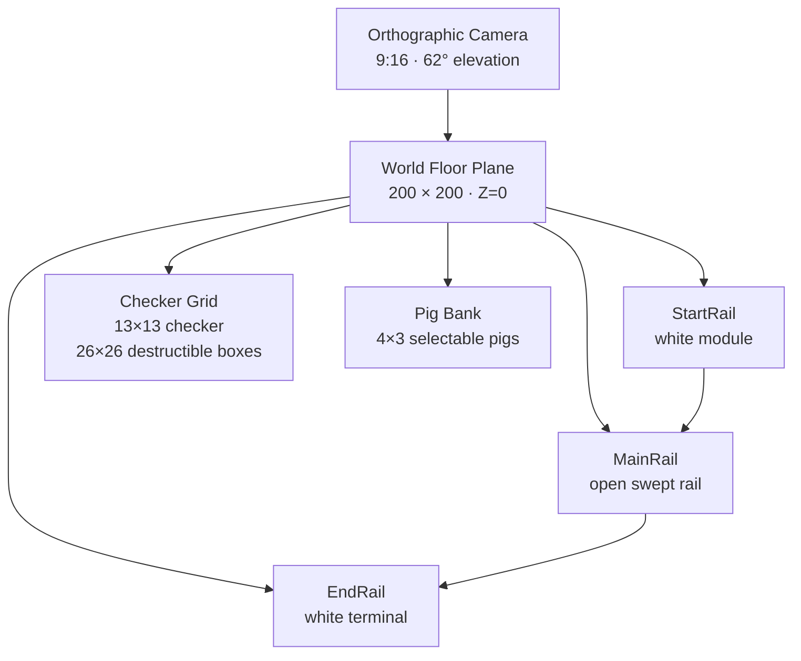

# Primitive Playable Recreation — Construction & Gameplay Specification

This document freezes the current prototype into an implementation spec for the primitive Three.js version. It is intended to be the handoff/reference before replacing primitives with final Fish of Fortune assets.

> Important axis note: this prototype currently uses **Z as height/up**, with gameplay laid out on the **XY ground plane**. That is not Three.js's usual Y-up convention. Keep this convention for this prototype unless the whole scene is migrated consistently.

## 1. Current scene constants

| System | Parameter | Value |
|---|---:|---:|
| Viewport | aspect | `9 / 16` portrait |
| Camera | type | `THREE.OrthographicCamera` |
| Camera | `WORLD_H` | `23.4` |
| Camera | elevation | `62°` |
| Camera | orbit distance basis | `24` |
| Camera | position | `(0.000, -10.017, 14.591)` |
| Camera | look target | `(0, 0.40, 0)` |
| Camera | near / far | `0.1 / 100` |
| Grid | checker pattern | `13 × 13` checker cells |
| Grid | actual destructible boxes | `26 × 26` |
| Grid | micro-box size | `0.3 × 0.3` |
| Grid | micro-box gap | `0.022` |
| Grid | center step | `0.322` |
| Grid | micro-box height | `0.84` |
| Grid | ground epsilon | `0.012` |
| Grid | origin X | `-4.025` |
| Grid | origin Y | `7.700` |
| Rail | side offset | `1.38` |
| Rail | top/bottom offset | `2.38` |
| Rail | corner radius | `1.1` |
| Rail | final vertical height | `0.38` |
| Rail | profile source | `PW=.34, PH=1.08, PR=.15` |
| Pig | body | `1.22 × 1.28 × 0.72` |
| Pig | front/mouth block | `0.62 × 0.26 × 0.24` |
| Pig bank | layout | `4 columns × 3 rows` |
| Pig bank | X step | `2.15` |
| Pig bank | Y step | `1.62` |
| Pig bank | first row Y | `-10.20` |
| Motion | pre-engage speed | `6.4 units/s` |
| Motion | post-engage speed | `10.7 units/s` |
| Aim | first 90° turn time | `0.028 s` |
| Projectile | sphere radius | `0.24` |
| Projectile | speed | `22 units/s` |
| Projectile | minimum travel duration | `0.045 s` |

## 2. Spatial skeleton

The visible game is composed from independent assets:



### Current world-space bounds

| Element | Approximate bounds / position |
|---|---|
| Grid X | `-4.025` → `4.025` |
| Grid Y | `-0.350` → `7.700` |
| Left rail center | `X=-5.405` |
| Right rail center | `X=5.405` |
| Top rail center | `Y=10.080` |
| Bottom rail center | `Y=-2.730` |
| Rail start | `(-4.125, -2.730)` |
| Rail end | `(-5.405, -0.450)` |
| Pig columns X | `-3.25, -1.10, 1.05, 3.20` |
| Pig rows Y | `-10.20, -11.82, -13.44` |

The grid is deliberately smaller than the rail footprint. Top/bottom spacing is larger than side spacing.

## 3. Camera

### Projection

```js
const WORLD_H = 23.4;
const aspect = 9/16;

camera.left   = -WORLD_H * aspect * 0.5;
camera.right  =  WORLD_H * aspect * 0.5;
camera.top    =  WORLD_H * 0.5;
camera.bottom = -WORLD_H * 0.5;
camera.near = 0.1;
camera.far = 100;
```

### Transform

The current camera includes the requested extra **world-Z translation of -5**:

```js
const elev = THREE.MathUtils.degToRad(62);
const dist = 24;

camera.position.set(
  0,
  -Math.cos(elev) * dist + 1.25,
  Math.sin(elev) * dist - 6.6
);

camera.lookAt(0, 0.40, 0);
```

Evaluated position:

```text
X = 0.000
Y = -10.017
Z = 14.591
```

The viewport is always fitted inside the browser as a centered `9:16` portrait frame.

## 4. World floor

Use one oversized invisible-boundary world plane instead of a floor box.

```text
Plane: 200 × 200
Position: (0, 0, 0)
Receives shadows: yes
Visible bounds in viewport: no
```

All grounded assets use `GROUND_EPS = 0.012` to avoid z-fighting.

## 5. Checker grid

The board is a strict checker pattern.

### Logical pattern

- `13 × 13` checker cells.
- Every logical checker cell contains exactly `2 × 2` destructible micro-boxes.
- Result: `26 × 26 = 676` individual destructible boxes.
- All four boxes inside one logical checker cell share the same color.
- Checker color uses:

```js
const isLight =
  ((Math.floor(r / 2) + Math.floor(c / 2)) & 1) === 0;
```

### Micro-box construction

```text
width  = 0.3
depth  = 0.3
height = 0.84
gap    = 0.022
step   = 0.322
pivot  = floor / local Z = 0
```

Each micro-box is individually destructible. Destroying one does not destroy the other three in its checker cell.

### Targeting rule

The pig can only target the **first still-alive micro-box** in the exact row/column lane facing it.

Examples:

```text
Bottom rail → scan column from bottom to top.
Top rail    → scan column from top to bottom.
Left rail   → scan row from left to right.
Right rail  → scan row from right to left.
```

A front block occludes every box behind it.

If the front block is the wrong color, the pig does not shoot through it.

## 6. Rail system

Treat the rail as **three separate assets**:

```text
StartRail
MainRail
EndRail
```

### StartRail

White standalone entry asset immediately before the bottom rail.

Approximate placement:

```text
X = START_X - 0.88
Y = BOTTOM
Z = floor
```

### MainRail

One open swept rail. It is **not a closed loop**.

Travel order:

```text
START
  ↓
bottom straight → bottom-right arc
  → right straight → top-right arc
  → top straight → top-left arc
  → left straight
  ↓
END
```

There is no bottom-left connecting corner.

### EndRail

White terminal on the lower part of the left side. The runner disappears when it reaches this terminal.

### Main rail bounds

```text
LEFT   = -5.405
RIGHT  = 5.405
TOP    = 10.080
BOTTOM = -2.730
```

### Rail cross section

Authored profile:

```text
PW = 0.34
PH = 1.08
PR = 0.15
```

The extruded geometry is normalized after construction so the final world-Z rail height is:

```text
RAIL_HEIGHT = 0.38
```

The rail bottom is aligned to the world floor.

## 7. Rail firing zones

The pig only checks for shots on straight, grid-aligned nodes.

```text
bottom straight → can shoot
bottom-right arc → cannot shoot
right straight → can shoot
top-right arc → cannot shoot
top straight → can shoot
top-left arc → cannot shoot
left straight → can shoot
terminal segment → cannot shoot
```

The top and bottom rails contain explicit non-shooting gap nodes outside the board width. These are the equivalent of the yellow-gap zones in the reference.

## 8. Pig bank

The bottom selection bank is `4 × 3`.

### Positions

```text
X = -3.25 + column * 2.15
Y = -10.20 - row * 1.62
Z = GROUND_EPS
```

### Pig primitive dimensions

Body:

```text
1.22 × 1.28 × 0.72
```

Front/mouth marker:

```text
0.62 × 0.26 × 0.24
local position = (0, 0.73, 0.58)
```

The pig's local `+Y` direction is its front/mouth direction.

### Selection behavior

When clicked:

1. Source pig is consumed.
2. Source pig becomes invisible permanently.
3. A separate runner instance is spawned on the rail.
4. The source pig is never reused.

## 9. Runner height

Bottom pigs stand on the floor.

Runner pigs stand on top of the rail:

```text
runner Z =
GROUND_EPS
+ RAIL_HEIGHT
+ 0.015

= 0.407
```

## 10. Gameplay flow

```mermaid
flowchart TD
    A["Player clicks unused pig"] --> B["Consume pig from bank"]
    B --> C["Spawn runner at StartRail"]
    C --> D["Move along rail at 6.4 u/s"]

    D --> EAt a straight firing node?
    E -- No --> D
    E -- Yes --> F["Find front-most alive box<br/>in exact axis lane"]

    F --> GSame color?
    G -- No --> D
    G -- Yes --> HFirst valid shot yet?

    H -- Yes --> I["Turn runner 90° inward<br/>0.028 s"]
    I --> J["Set engaged = true"]
    J --> K["Fire sphere from mouth"]

    H -- No --> K

    K --> L["Projectile travels to front box"]
    L --> M["Destroy exactly one micro-box"]
    M --> N["Continue at 10.7 u/s<br/>runner remains 90° inward"]

    N --> OEndRail reached?
    O -- No --> E
    O -- Yes --> P["Remove runner"]
```

## 11. Pig orientation state

There are two orientation states.

### Before first valid shot

The pig follows the rail travel orientation.

```text
bottom rail → faces travel direction
right rail  → faces travel direction
top rail    → faces travel direction
left rail   → faces travel direction
```

### After first valid shot

At the first legal target:

```text
rail-facing
→ rotate 90° toward board
→ shoot
→ remain in the 90° inward orientation
```

From that point onward the pig remains offset by `+90°` relative to the rail tangent and moves faster.

It still follows the changing rail tangent through corners, but keeps that 90° inward offset.

## 12. Movement speeds

```text
MOVE_SPEED         = 6.4 units/s
ENGAGED_MOVE_SPEED = 10.7 units/s
AIM_TIME           = 0.028 s
```

Movement duration is distance-based:

```js
const distance = run.from.distanceTo(run.to);
run.stepDuration =
  distance / (run.engaged ? ENGAGED_MOVE_SPEED : MOVE_SPEED);
```

This keeps arc motion and straight motion at consistent world-space speed.

## 13. Projectile

Projectile geometry:

```text
THREE.SphereGeometry
radius = 0.24
segments = 16 × 12
material = same white/black material as pig
```

Spawn position is the pig's mouth/front:

```js
const mouthLocal = new THREE.Vector3(0, 0.92, 0.67);
const a = run.runner.localToWorld(mouthLocal.clone());
```

Projectile target height:

```text
GRID_HEIGHT × 0.72
= 0.605
```

Travel:

```text
SHOT_SPEED = 22 units/s
minimum duration = 0.045 s
```

```js
duration = Math.max(
  0.045,
  start.distanceTo(target) / SHOT_SPEED
);
```

## 14. Color rules

There are only two gameplay colors in the primitive version:

```text
WHITE pig → WHITE blocks only
BLACK pig → BLACK blocks only
```

The pig cannot:

- shoot the opposite color;
- skip a wrong-color front box;
- shoot through another box;
- shoot diagonal lanes;
- shoot during rail corners;
- shoot outside a grid-aligned firing node.

## 15. Lighting and shadows

Renderer:

```text
shadow map = THREE.PCFShadowMap
```

Hemisphere:

```text
sky = 0xffffff
ground = 0x303449
intensity = 1.65
```

Directional key:

```text
position = (10, -14, 18)
target   = (0, 1.5, 0)
intensity = 2.65
```

Intent: projected shadows travel visually from lower-right toward upper-left.

Shadow setup:

```text
map size = 2048 × 2048

camera left   = -18
camera right  = 18
camera top    = 22
camera bottom = -22
camera near   = 0.5
camera far    = 70

bias       = -0.00035
normalBias = 0.025
radius     = 2.0
```

## 16. Recommended asset split for Houdini / Blender / GLB

Keep these as separate named assets/transforms:

```text
World
├── Camera_Main
├── Floor
├── GridRoot
│   ├── Cell_00_00
│   ├── Cell_00_01
│   └── ...
├── Rail_Start
├── Rail_Main
├── Rail_End
├── PigBankRoot
│   ├── Pig_00
│   ├── Pig_01
│   └── ...
└── GameplayAnchors
    ├── RailStart
    ├── RailEnd
    ├── GridCenter
    └── CameraTarget
```

For the styled version, geometry can be replaced while preserving these transforms and names.

## 17. Implementation phases

### Phase 1 — Primitive spatial match

Goal: lock composition before polishing.

- Camera and `9:16` framing.
- Floor plane.
- 13×13 checker / 26×26 destruction grid.
- Start/Main/End rail split.
- 4×3 pig bank.
- Exact spacing and height relationships.
- No final assets.

### Phase 2 — Gameplay match

- Click unused pig.
- Consume source pig.
- Spawn rail runner.
- Front-only lane targeting.
- Color matching.
- First legal target triggers the 90° engagement turn.
- Same world-speed on straight/arc segments.
- Runner disappears at terminal.

### Phase 3 — Feel

Tune and document:

```text
MOVE_SPEED
ENGAGED_MOVE_SPEED
AIM_TIME
SHOT_SPEED
projectile radius
rail corner subdivision
camera WORLD_H
camera transform
```

### Phase 4 — Polish

- Impact scale/squash.
- Small destruction pop.
- Mouth flash.
- Rail entry feedback.
- Better material roughness.
- Softer shadow presentation.
- Win/CTA sequence only after reference gameplay is fully matched.

### Phase 5 — Fish of Fortune reskin

Replace primitives without changing gameplay state:

```text
primitive pig      → Fish of Fortune pig asset
checker micro-box  → styled block asset
main rail          → stylized tube/track
start/end modules  → themed terminals
floor              → FoF environment
primitive material → FoF palette/materials
```

## 18. Acceptance checklist

- [ ] Portrait `9:16`.
- [ ] Camera values frozen and documented.
- [ ] No visible floor-plane bounds.
- [ ] Grid is a true 13×13 checker.
- [ ] Every checker is 2×2 independent destructible boxes.
- [ ] Rail is open, not a full loop.
- [ ] Start, main rail, and end are separate assets.
- [ ] No shooting on arcs.
- [ ] No shooting through front blockers.
- [ ] White only shoots white.
- [ ] Black only shoots black.
- [ ] First legal target triggers one 90° engagement turn.
- [ ] Pig stays inward-facing after engagement.
- [ ] Engaged movement is faster.
- [ ] Projectile comes from mouth/front.
- [ ] Projectile is same color as pig.
- [ ] Source pig is consumed once.
- [ ] Runner disappears at EndRail.
- [ ] Grid, pigs, and rail cast readable shadows onto one world plane.
